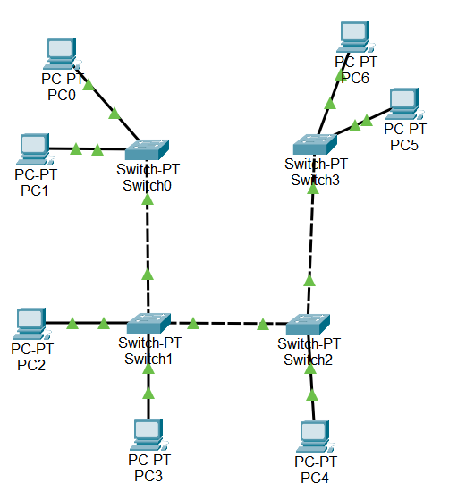
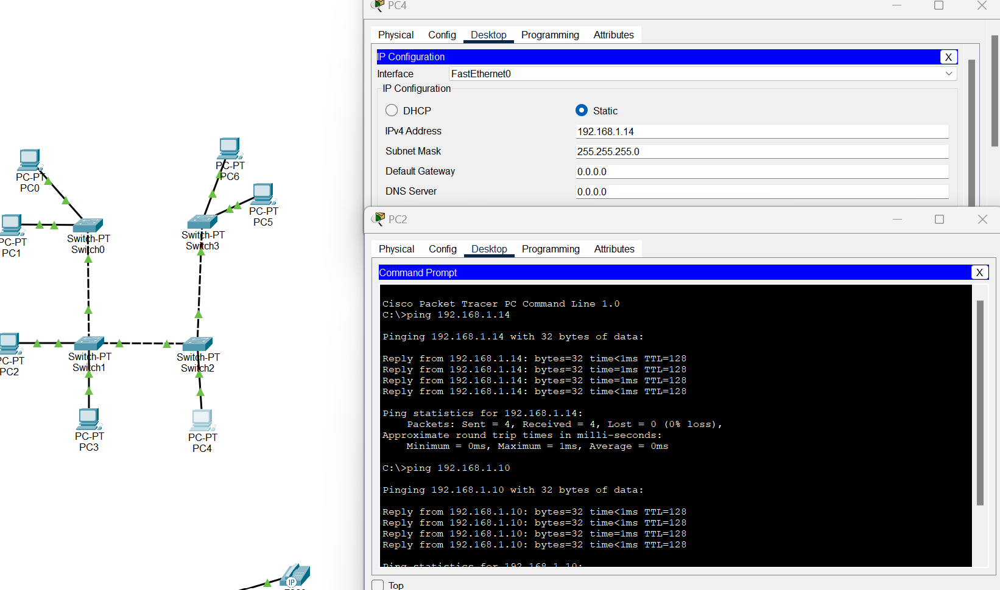
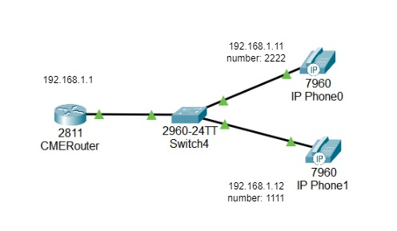
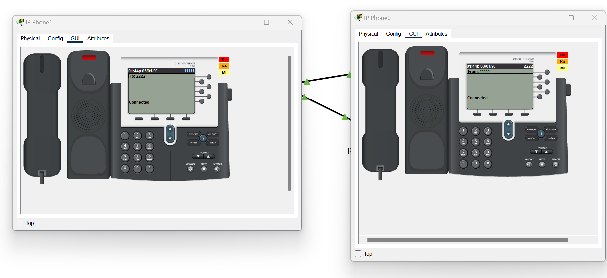

#### University: [ITMO University](https://itmo.ru/ru/)

##### Faculty: [FICT](https://fict.itmo.ru)

##### Course: [Ip Telophony](https://itmo-ict-faculty.github.io/ip-telephony/)

Group: K34202

Author: Konovalenko Maxim Pavlovich

Lab: Lab1

Date of create: 11.02.2024

Date of finished: 18.02.2024

## Отчёт по лабораторной работе №1 "Базовая настройка ip-телефонов в среде Сisco packet tracer"

**Цель работы:** Изучить рабочую среду Cisco Packet Tracer, ознакомить- ся с интерфейсами основных устройств, типами кабелей, научиться собирать топологию. Изучить построение сети IP-телефонии с помощью маршрутизатора, коммутатора и IP телефонов Cisco 7960 в среде Packet tracer

**Ход работы:**

### 1. Создание простой топологии сети.

Изучили теоретическую и практическую части работы, собрали схему соединения, состоящую из компьютеров и коммутаторов.



Для каждого компьютера был назначен айпи адрес на соответствующем интерфейсе (192.168.1.10-192.168.1.16)

```
en
conf t
interface FastEthernet 0/0
ip address 192.168.1.10 255.255.255.0
no shutdown
```

После настройки каждого копьютера проверим связность сети, пропингуем компьютеры между друг другом.



### 2. Создание схемы связи с ip-телефонами.



Поднимаем DHCP сервер на маршрутизаторе для IP – телефонов:

```
en
conf t
ip dhcp pool voice
network 192.168.0.0 255.255.255.0
default-router 192.168.1.1
exit
```

Дальше нужно дать дополнительную команду для опции 150. Она позволяет подтягивать и автоматически подтягивать прошивки для телефонов с TFTP сервера.

```
en
conf t
ip dhcp pool voice
option 150 ip 192.168.1.1
```

Настроим классические VoIP параметры

```
en
conf t
telephony-service
max-dn 15
max-ephones 15
ip source-address 192.168.1.1 port 3100
auto assign 1 to 19
```

Двигаемся к настройке свича. Нам нужно только включить поддержку VoIP на интерфейсах (голосовой VLAN):

```
en
conf t
interface range FastEthernet 0/1 - FastEthernet 0/2
switchport mode access
switchport voice vlan 1
exit
```

На роутере присвоим телефонные номера нашим устройствам

```
en
conf t
ephone-dn 1
number 11111
exit
ephone-dn 2
number 2222
exit
```

Можно пробовать звонить.

Проверка соединения телефонов:


## Вывод:

В результате выполнения работы изучили рабочую среду Cisco Packet Tracer, ознакомились с интерфейсами основных устройств, типами кабелей, научились собирать топологии. Изучили построение сети IP-телефонии с помощью маршрутизатора, коммутатора и IP телефонов Cisco 7960 в среде Packet tracer
