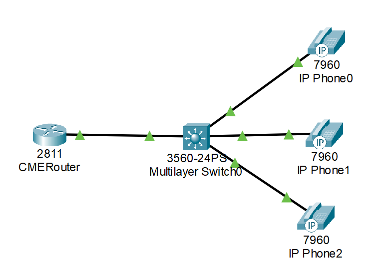
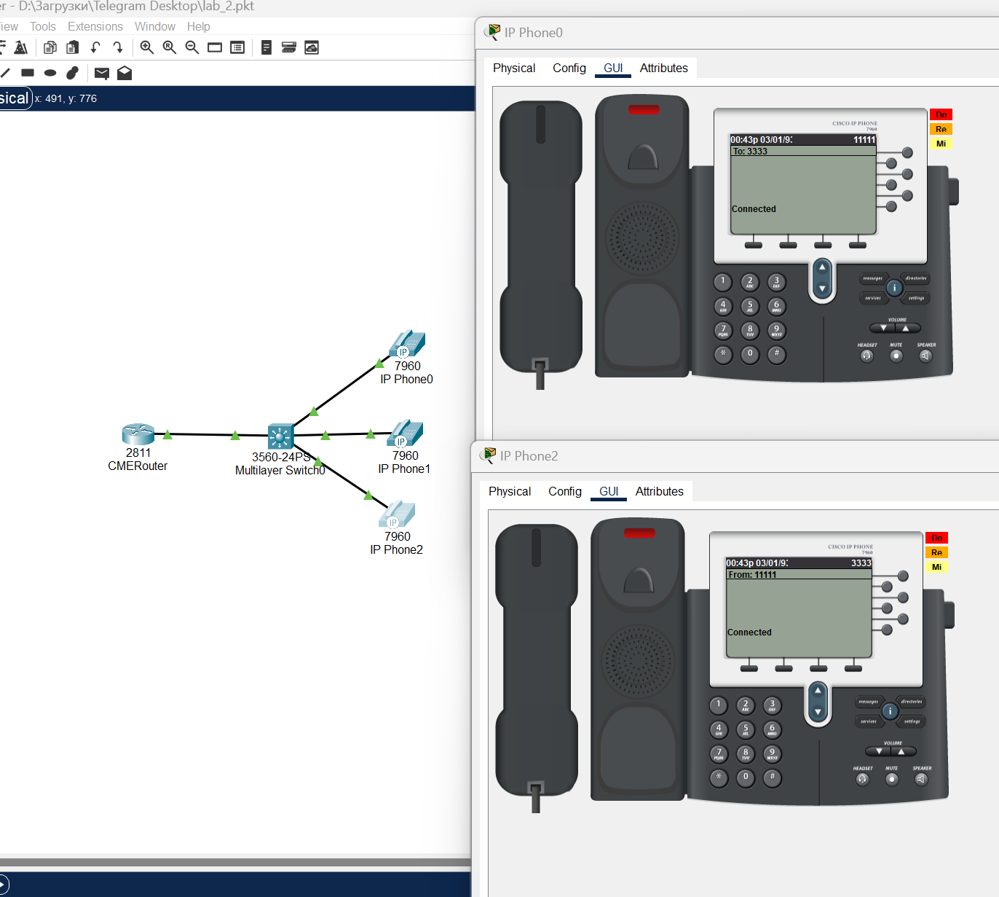
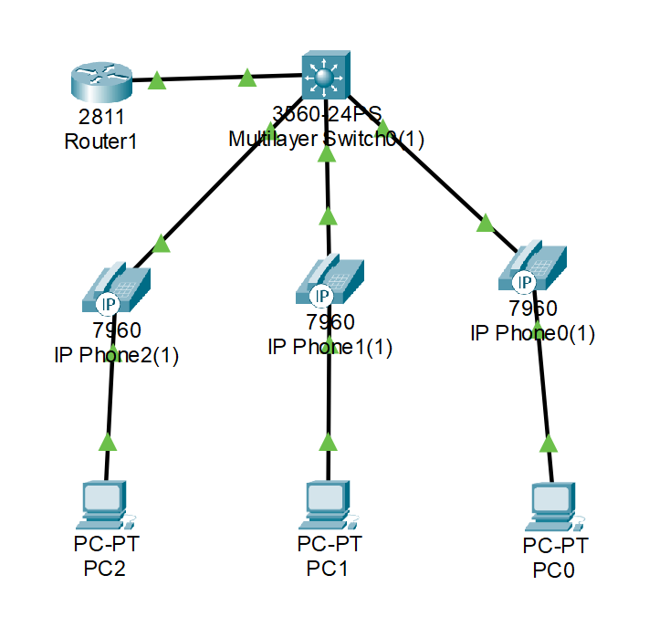
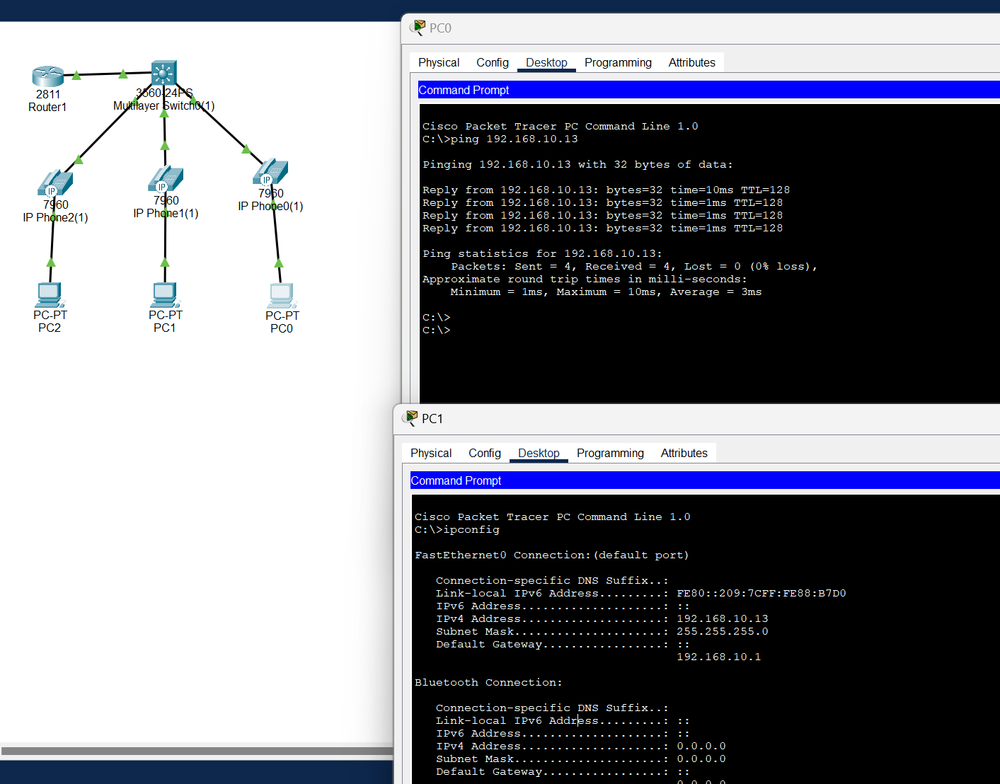
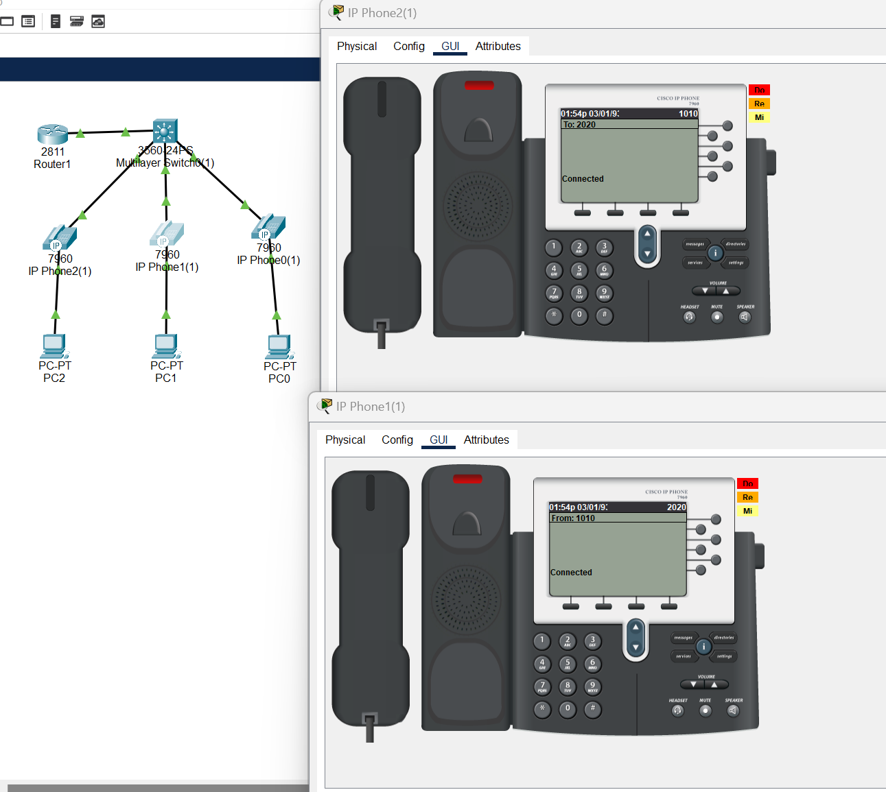

#### University: [ITMO University](https://itmo.ru/ru/)

##### Faculty: [FICT](https://fict.itmo.ru)

##### Course: [Ip Telephony](https://itmo-ict-faculty.github.io/ip-telephony/)

Group: K34202

Author: Konovalenko Maxim Pavlovich

Lab: Lab2

Date of create: 18.02.2024

Date of finished: 27.02.2024

## Отчёт по лабораторной работе №2 "Конфигурация voip в среде Сisco packet tracer"

**Цель работы:** Изучить построение сети IP-телефонии с помощью маршрутизатора Cisco 2811, коммутатора Cisco catalyst 3560 и IP телефонов Cisco 7960.

**Ход работы:**

### Часть 1.

Изменили название маршрутизатора на CMERouter.



Для того, чтобы отключить синтакс ввода слов от DNS серверов

```
no ip domain-lookup
```

Задание пароля для защиты маршрутизатора

```
line con 0
 password cisco
 logging synchronous

line aux 0

line vty 0 4
 password cisco
 logging synchronous
 login
```

Настройка интерфейса и DHCP сервера на маршрутизаторе аналогично настройке в первой лабораторной работе

```
interface FastEthernet 0/0
ip address 192.168.1.1 255.255.255.0
no shutdown

ip dhcp excluded-address 192.168.1.1 192.168.1.10
ip dhcp pool MY-POOL
 network 192.168.1.0 255.255.255.0
 default-router 192.168.1.1
 option 150 ip 192.168.1.1
```

Настройка услуг телефонии и выдача номеров для трех телефонов

```
telephony-service
 max-ephones 15
 max-dn 15
 ip source-address 192.168.1.1 port 3100
 auto assign 1 to 19

ephone-dn 1
 number 11111

ephone-dn 2
 number 2222

ephone-dn 3
 number 3333
```

Создадим VLAN порты на коммутаторе

```
interface FastEthernet0/1
 switchport trunk encapsulation dot1q
 switchport mode trunk
 switchport voice vlan 1

interface FastEthernet0/2
 switchport mode access
 switchport voice vlan 1

interface FastEthernet0/3
 switchport mode access
 switchport voice vlan 1

interface FastEthernet0/4
 switchport mode access
 switchport voice vlan 1
```

После настройки маршрутизатора и коммутатора включим наши телефоны и проверим их связность



### Часть 2.

Создали новую топологию.



Создадим 2 VLAN порта на коммутаторе для взаимодействия коммутатора с маршрутизатором.

```
vlan 10
name data
vlan 20
name voice
```

Настройка интерфейсов на коммутаторе:

```
interface FastEthernet0/1
 switchport trunk native vlan 30
 switchport trunk encapsulation dot1q
 switchport mode trunk
 switchport voice vlan 1

interface FastEthernet0/2
 switchport access vlan 10
 switchport mode access
 switchport voice vlan 20

interface FastEthernet0/3
 switchport access vlan 10
 switchport mode access
 switchport voice vlan 20

interface FastEthernet0/4
 switchport access vlan 10
 switchport mode access
 switchport voice vlan 20
```

Установка маршрута по умолчанию

```
ip default-gateway 192.168.30.1
```

Настройка DHCP сервера для передачи голоса и данных на маршрутизаторе.

```
ip dhcp excluded-address 192.168.10.1 192.168.10.10
ip dhcp excluded-address 192.168.20.1 192.168.20.10

ip dhcp pool DATA
 network 192.168.10.0 255.255.255.0
 default-router 192.168.10.1
ip dhcp pool VOICE
 network 192.168.20.0 255.255.255.0
 default-router 192.168.20.1
 option 150 ip 192.168.20.1

interface FastEthernet0/0.10
 encapsulation dot1Q 10
 ip address 192.168.10.1 255.255.255.0

interface FastEthernet0/0.20
 encapsulation dot1Q 20
 ip address 192.168.20.1 255.255.255.0
```

Настройка сервиса телефонии на маршрутизаторе

```
telephony-service
 max-ephones 15
 max-dn 15
 ip source-address 192.168.20.1 port 3100
 auto assign 1 to 19

ephone-dn 1
 number 1010

ephone-dn 2
 number 2020

ephone-dn 3
 number 3030
```

Проверка соединения компьютеров:


Проверка соединения телефонов:


## Вывод:

В результате выполнения работы изучено построение сети IP-телефонии с помощью маршрутизатора Cisco 2811, коммутатора Cisco catalyst 3560 и IP телефонов Cisco 7960.
