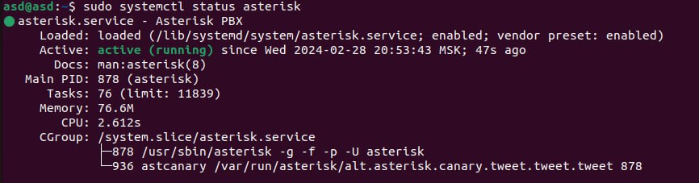
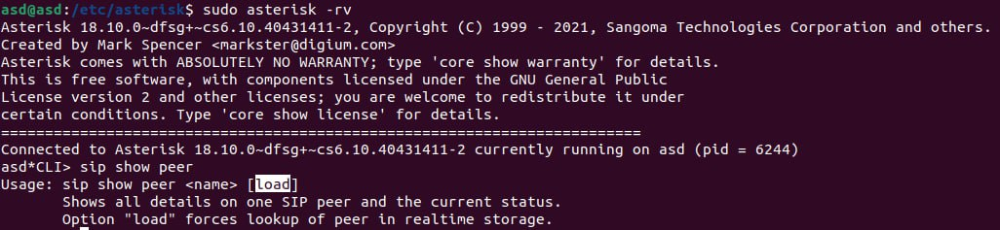
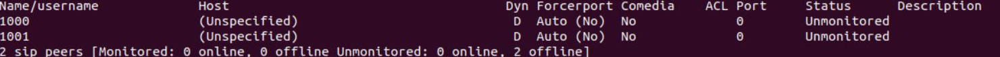
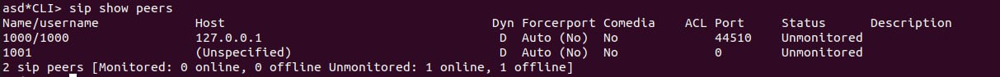
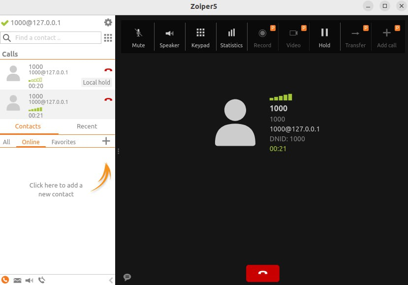

#### University: [ITMO University](https://itmo.ru/ru/)

##### Faculty: [FICT](https://fict.itmo.ru)

##### Course: [Ip Telephony](https://itmo-ict-faculty.github.io/ip-telephony/)

Group: K34202

Author: Konovalenko Maxim Pavlovich

Lab: Lab3

Date of create: 25.02.2024

Date of finished: 05.03.2024

## Отчёт по лабораторной работе №2 "Использование Asterisk в качестве SIP proxy"

**Цель работы:** Изучить программный комплекс Asterisk. Настройка Asterisk для локальных звонков.

**Ход работы:**

### Часть 1. Настройка Asterisk

Первым делом установим на Ubuntu Asterisk, используя команду

```
sudo apt install asterisk
```

Далее в файле конфига астериска добавим информацию о телефонах, в /etc/asterisk/sip.conf допишем данные для наших двух телефонов

```
[1000]
type=friend
host=dynamic
secret=1000
context=ext_1000

[1001]
type=friend
host=dynamic
secret=1001
context=ext_1001
```

В файл /etc/asterisk/extensions.conf добавили определение для расширений

```
[ext_1000]
exten => _XXXX,1,Dial(SIP/${EXTEN})

[ext_1001]
exten => _XXXX,1,Dial(SIP/${EXTEN})
```

Проверим статус астериска, чтобы убедиться, что он работает и статус running



Далее необходимо при помощи команды sudo asterisk -rv подключиться к CLI asterisk, где мы убедились в создании нами sip peers.



В cli астериска проверяем командой sip show peers, созданные нами sip peers в настройках конфигурации



### Часть 2. Установка Zoiper

Мы выбрали Zoiper для установки софт телефонов на рабочую станцию


После успешного логина мы подключили 2 наших телефона, указав данные: номер, пароль, а также адрес сервера (127.0.0.1)

Снова пишем в cli астериска sip show peers и видим, что у нашего телефона добавился host



Проверяем связность наших телефонов и делаем звонок.



Соединение установлено.

## Вывод:

В результате выполнения работы изучен программный комплекс Asterisk. Также настроили Asterisk для локальных звонков
